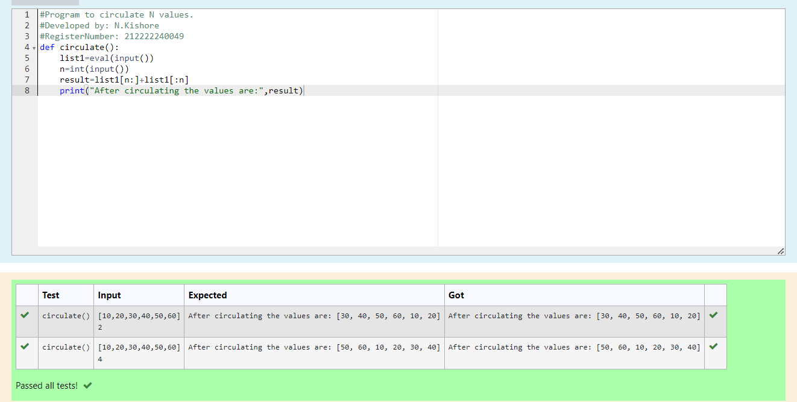

# Circulate-the-values-of-N-variables
## Aim:
To write a python program to circulate the n variables using function concept
## Equipment’s required:
PC
Anaconda - Python 3.7
## Algorithm: 
### Step 1:
Import def circulate
### Step 2: 
Prepare the lists from each linear equations
### Step 3: 
Get the value from the user for the number of rotation
### Step 4: 
Using the slicing concept rotate the list
### Step 5:
Print the values that would be circulated
### Step 6:
End the program

## Program:
```
#Program to circulate N values.
#Developed by: N.Kishore
#RegisterNumber: 212222240049
def circulate():
    list1=eval(input())
    n=int(input())
    result=list1[n:]+list1[:n]
    print("After circulating the values are:",result)
```
## Output:


## Result:
Thus the program to circulate the values of N variables is successfully executed.
